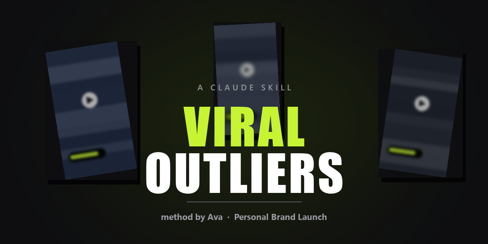

# Instagram Viral Reels Research — a skill for Claude Code and Codex

**Find the reels that are actually working in your niche, and get back a script you can record today.**

Ask Claude for research and it sweeps Instagram, keeps only the reels that genuinely outperformed,
downloads each one, **watches it frame by frame**, **transcribes the audio**, and hands you a clean
`.md` card: the literal script, the formula behind it with the blanks exposed, **your version of it**,
and the caption.

> **Also known as:** viral reel finder · Instagram content research · reel script generator ·
> hook research · short-form video research · viral video analysis · content idea generator ·
> Instagram outlier research

> 🇪🇸 **¿Buscas esto en español?** → [salta a la sección en español](#español) · la skill funciona
> en español, y los guiones los escribe en tu idioma.

Built on the research method taught by **Ava Yuergens
([@personalbrandlaunch](https://www.instagram.com/personalbrandlaunch/))**. All strategy credit is
hers. This repo only automates her process.

---

## What it does

```
your brand profile  +  a fresh sweep of Instagram
        ↓
the reels that genuinely outperformed (the 5X rule)
        ↓
each one downloaded, watched in 6 frames, audio transcribed
        ↓
one .md card per reel:  literal script · the formula with blanks ·
                        your version · the caption
```

**It does not summarise the caption.** It downloads the MP4, pulls frames, and runs the audio
through Whisper — because the caption is not the script, and a reel with 8.9M views can turn out
to be one sentence of speech over a silent demo.

---

## What is a "viral outlier"?

If the word is new to you, it is the whole idea in one line:

> **An outlier is a reel that did far better than the account that posted it should be able to do.**

A 2-million-view reel from a 3-million-follower account is not impressive — that account reaches
2 million on a bad day. A 2-million-view reel from a **4,000-follower** account is a different
thing entirely. Nobody watched it because they knew the person. **They watched it because the video
itself worked.**

That second video is worth studying. The first one is not.

So the skill keeps only reels that clear two bars:

```
BAR 1: at least 700,000 views        below this it never really met a cold audience
BAR 2: at least 5x the followers     below this the account carried it, not the video
```

Everything else gets thrown away before you waste a minute on it.

---

## Install

**Codex (macOS)**

```bash
git clone https://github.com/JSNGe/instagram-viral-reels-research-skill
cp -R instagram-viral-reels-research-skill/skills/viral-outliers ~/.codex/skills/
```

The installed entry point is `~/.codex/skills/viral-outliers/SKILL.md`. The Codex-compatible copy
keeps the helper programs inside the skill at `scripts/getreel.sh` and
`scripts/transcribe.py`, so the installed folder is self-contained. Restart Codex or begin a new
turn after installation so the skill catalog refreshes.

Before the first research run, edit
`~/.codex/skills/viral-outliers/references/brand-profile.md`. Then check the dependencies:

```bash
agent-reach doctor --json
opencli doctor
ffmpeg -version
python3 -c "import faster_whisper; print('faster-whisper ready')"
```

Example request in Codex:

```text
Use $viral-outliers to research Instagram Reels about AI portrait photography. Find up to 10
reproducible outliers with at least 700,000 views and at least 5x the creator's follower count.
For every survivor, inspect at least six frames, transcribe the complete audio from 0.0 seconds,
separate spoken audio, on-screen text, and caption, then give me the literal script, its reusable
formula, and a version adapted to my brand profile. Keep all Instagram actions read-only.
```

**Claude Code**

```bash
git clone https://github.com/w-avw/instagram-viral-reels-research-claude-skill
cp -r instagram-viral-reels-research-claude-skill/skills/viral-outliers ~/.claude/skills/
```

Or drop it in `.claude/skills/` inside a project to scope it there.

**Then fill in your brand profile** — `skills/viral-outliers/references/brand-profile.md`.
This is not optional. It is what makes "your version" of a script sound like you instead of like
everyone else. It is also the part you keep refining: every time you rewrite a script the skill
gave you, you log the correction, and it stops making that mistake.

**Trigger it** with anything like:

```
find me viral reels in my niche
research instagram reels about <topic>
what should I post this week
give me a script for a video about <topic>
find viral outliers and write my version
buscame reels virales de mi nicho y escribeme el guion
```

---

## Requirements

| | |
|---|---|
| **[agent-reach](https://github.com/Panniantong/Agent-Reach)** | Routes anything that touches the internet. Run `agent-reach doctor --json` first |
| **[OpenCLI](https://github.com/jackwener/opencli)** | Instagram access, reusing your own logged-in Chrome session. **Read-only** |
| **ffmpeg** | Frame extraction and audio |
| **faster-whisper** | Transcription. `pip install faster-whisper` |
| **Chrome** | With the OpenCLI extension loaded and connected |

On macOS, install `ffmpeg` with Homebrew if needed (`brew install ffmpeg`) and install the Python
package with `python3 -m pip install faster-whisper`. `agent-reach` and `OpenCLI` have their own
installation instructions at the linked upstream projects. Instagram discovery depends on a live,
logged-in Chrome session and may stop working when Instagram changes private web endpoints.

```bash
agent-reach doctor --json     # which backend serves each platform
opencli doctor                # must say "Extension: connected"
```

**No Instagram API key, no scraping service, no paid tool.** It reads through the session you are
already logged into.

### Read-only, always

The skill only ever issues GET requests and read commands — `profile`, `user`, `explore`,
`search`, `download`. It never follows, likes, comments, posts or saves. Those act on your real
account and are explicitly forbidden in the skill file.

---

## The method, in short

### 1 · Two filters, in this order

```
FILTER 1: absolute views >= 700,000      without this it never met a cold audience
FILTER 2: views >= 5x followers          without this it is just a big account
```

Ava's own instruction: *"pull 100+ reels with millions of views, then apply the 5X rule."*
Most people skip the first one and end up with a 3,800-view reel from a 700-follower account.

### 2 · Watch it. All of it.

Six frames minimum, spread across the video, read as one contact sheet. **One frame lies.**

### 3 · Transcribe the audio

Whisper's defaults **silently drop the opening seconds** when music sits over the speech. That is
where the hook is. The skill ships the parameters that turn those heuristics off, plus one hard
check:

> **The first transcript line must read `[ 0.0s]`.** If it starts at 4, 9 or 11 seconds, it is
> truncated and you are about to write the wrong hook onto the card.

### 4 · Discard by function, not by metrics

```
1. What does the video actually SAY?
2. Does that fulfil the JOB of the piece you need?
```

Nine million views do not put a lesson inside a video that has none.

And discard what you cannot film: 3D animation, MrBeast-scale shoots, memes, gear reviews.
**Can you film it alone, in your room, in under an hour?**

### 5 · Turn it into a formula

```
"Two guys have a different ___. The first uses ___. At first this works, but ___.
 The second uses ___. Instead of ___, the only way is ___."
```

The formula is what makes one reel produce ten pieces.

### 6 · Write your version

**The template is literal.** Only what is in parentheses changes.

> **The test:** count the sentences in your script, count the steps in the formula.
> More sentences than steps means there is filler.

What does not fit is not cut information — **it is another video.**

---

## What a card looks like

````markdown
# @account

*2,803,107 views · 4,006 followers · 699.7x · 31 s · digital habits*
*94,003 likes · 512 comments · 3,017 shares*

*Verbal hook: "Two guys have a different screen time."*
*Visual hook: the same person playing both, same bed, different shirt.*

*Format: 2 PEOPLE. One does the obvious thing and fails through a loophole;
the other does the strange thing and wins. Shot in his bedroom.*

---

## THE SCRIPT

```
[ 0.0s] Two guys have a different screen time. The first guy uses Apple's blocker.
[ 3.6s] At first, this works. After a while, he finds out he can just click ignore…
```

*The formula: `Two guys have a different ___. The first uses ___. At first this works,
but he finds out ___ [the loophole]. The second uses ___. So this forces him to ___.`*

---

## MY VERSION

…your hooks, your script, what cannot change, production notes…

---

## THE CAPTION

**Theirs, literal:** … *The formula:* … **Yours:** …
````

---

## Why the caption gets its own section

Measured across sixteen outliers, **not one repeats what the video already said**:

| What the caption does | Seen in |
|---|---|
| Only the CTA, 58 characters | AI tooling accounts |
| Only the title, 39 characters | A video-editing account |
| The fine print of the maths, plus a disclaimer | A personal-finance account |
| The actual advert — price, hours, address, phone | A local restaurant |
| The series counters (`DAY 68/90`) | A study-challenge account |
| The keyword at the top *and* again at the bottom | A skincare account |

The video and the caption do different jobs. The skill copies the *shape*, not the words.

---

## The mistakes it already knows about

Section 9 of the skill file is a list of real failures from running this method, so an agent does
not repeat them. Among them:

- Writing a script from the caption. The real video had no voice at all.
- Watching frames but not listening. 8.9M views, and the entire audio was one sentence.
- Accepting a truncated transcript, which put the wrong hook on four cards.
- Padding a 5-step template into 15 sentences until the template disappeared.
- Inventing a quote the user had never said, because it sounded good.
- Proposing a mold the user physically could not film.

---

## FAQ

### Is there a Claude skill for finding viral Instagram Reels?

This is one. It runs inside Claude Code as a skill, sweeps Instagram for reels that outperformed
their account, and returns the script rather than a list of links.

### How do I research viral reels in my niche?

Fill in the brand profile so it knows your niche and who buys from you, then ask for research.
It sweeps, filters by the 5X rule, watches and transcribes each survivor, and writes a card per reel.

### Can Claude Code write an Instagram Reel script for me?

Yes, but the point is *what it writes from*. It does not invent a script out of thin air — it takes
a reel that provably worked, strips it to its formula, and refills the blanks with your business,
your numbers and your words.

### Do I need an Instagram API key or a paid scraping service?

No. It reads through your own logged-in Chrome session via OpenCLI. Nothing is purchased and
nothing is posted.

### Will it touch my account — follow, like, comment, post?

No. The skill is read-only by design and those commands are explicitly forbidden in it.

### Does it work in Spanish, or in other languages?

Yes. The transcription auto-detects language and the scripts are written in whichever language your
brand profile is in. This README is in English; the skill is not.

### How is this different from just asking an AI for hook ideas?

An AI asked for hooks invents plausible ones. This one only ever hands you structures that already
worked on a cold audience, with the view counts attached and the audio transcribed to prove it.

### What makes a reel an "outlier"?

At least 700,000 views **and** at least 5× the account's follower count. Both bars, in that order.

---

## Español

**Una skill de Claude Code para hacer research de reels virales de Instagram.**

Le pides research y barre Instagram, se queda solo con los reels que de verdad rindieron por encima
de su cuenta, se descarga cada uno, **lo ve fotograma a fotograma**, **transcribe el audio**, y te
devuelve una ficha `.md` con el guion literal, la fórmula con los huecos a la vista, **tu versión**,
y la descripción del video.

**Qué es un "viral outlier":** un reel que rindió muchísimo más de lo que su cuenta debería poder.
Dos millones de vistas desde una cuenta de tres millones de seguidores no dice nada. Dos millones
desde una cuenta de cuatro mil, sí — a ese nadie lo vio por conocer a la persona. **Lo vieron
porque el video funcionaba.**

**Los dos filtros, en este orden:**

```
FILTRO 1: mínimo 700.000 vistas         sin esto nunca salió a público frío
FILTRO 2: mínimo 5x sus seguidores      sin esto lo cargó la cuenta, no el video
```

**Lo que la hace distinta:** no lee la descripción del video y escribe desde ahí. Baja el MP4, saca
los fotogramas y pasa el audio por Whisper. Un reel de 8,9 millones de vistas puede resultar ser una
sola frase hablada sobre una demo muda — y eso solo se sabe escuchándolo.

**Instalación:**

```bash
git clone https://github.com/w-avw/instagram-viral-reels-research-claude-skill
cp -r instagram-viral-reels-research-claude-skill/skills/viral-outliers ~/.claude/skills/
```

Después rellena `references/brand-profile.md` con tu negocio, tus cifras reales, **las palabras que
usa tu cliente** y las que tu público no entiende. Eso es lo que hace que "tu versión" suene a ti.
Y cada vez que corrijas un guion, anotas la corrección — así deja de repetir el error.

**Solo lectura.** Nunca sigue, da like, comenta ni publica. Entra con tu propia sesión de Chrome.

**Todo el método es de Ava Yuergens ([@personalbrandlaunch](https://www.instagram.com/personalbrandlaunch/)).**
La regla del 5X, los siete tipos de hook, las once estructuras de guion, la escalera de CTA. Este
repo solo automatiza lo que ella enseña en abierto. **Ve a aprender de ella directamente.**

---

## Credit

The strategy is **Ava Yuergens'** — the 5X rule, the seven hook types, the eleven script
structures, the CTA ladder, the caption discipline. She teaches all of it on
[@personalbrandlaunch](https://www.instagram.com/personalbrandlaunch/).

This repo is an unaffiliated automation of her publicly taught method, built because it worked.
**Go learn from her directly.**

## Upstream and Codex compatibility

This repository is a Codex-compatible derivative of
[`w-avw/instagram-viral-reels-research-claude-skill`](https://github.com/w-avw/instagram-viral-reels-research-claude-skill),
based on upstream commit `a6d84757dd9518a4db348f733fdd17555c19e1a4` (2026-08-19).
The original MIT license and author attribution are preserved. See [UPSTREAM.md](UPSTREAM.md) for
the exact source and the compatibility changes.

---

## License

MIT. See [LICENSE](LICENSE).

---

<sub>claude skill · claude code skill · instagram reels research · viral reels finder · how to find
viral instagram reels · instagram viral video research · reel script generator · short form video
hooks · content research automation · viral outliers · 5x rule · ava yuergens · personal brand
launch method · reel transcription whisper · instagram content strategy ai · agent-reach · opencli
instagram · social media content agent · skill de claude para instagram · buscar reels virales ·
research de reels virales · guiones para reels · claude code español</sub>
